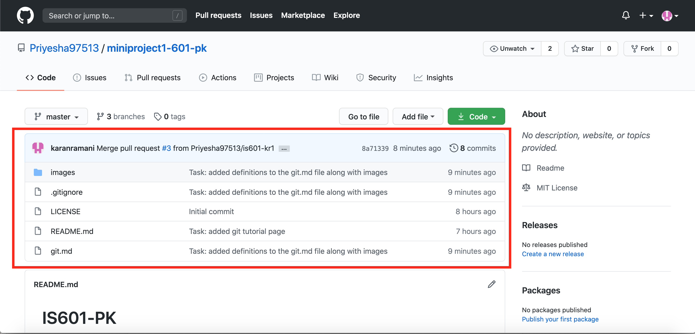
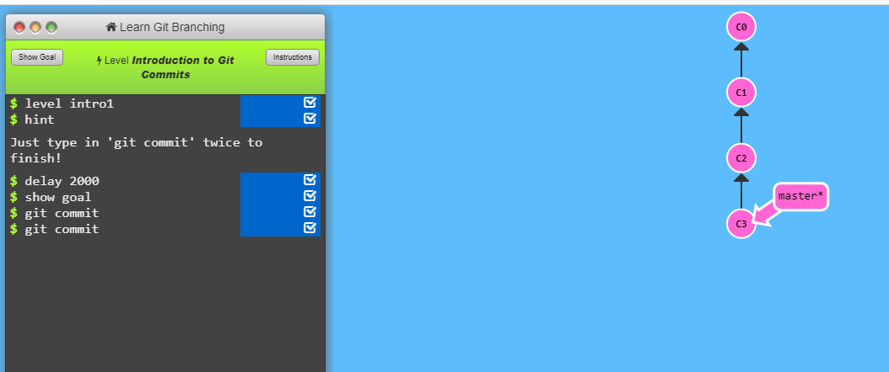
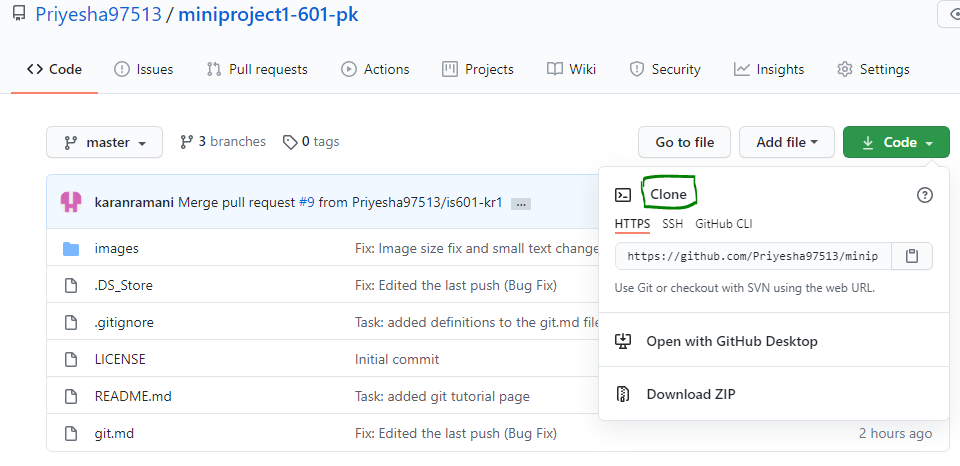

# Git Tutorial

- [x] @mentions, #refs, [links](), **formatting**, and <del>tags</del> supported
- [x] list syntax required (any unordered or ordered list supported)
- [x] this is a complete item
- [ ] this is an incomplete item

### Benefits of using Git, Docker, automated testing, and continuous integration:
 
* Git repository is a version-control system that is used to keep track of the collaborative work amongst the various number of team members within the source code. It is a system that one can use to track the changes for coordinating work and track changes in any set of files that an individual person and/or organization has attended to within the repository.
* Docker provides the ability to package and run an application in a loosely isolated environment called a container. The isolation and security allow you to run many containers simultaneously on a given host.
* Automated testing is used to keep the software being tested separated from the original software itself. It is used to predict the outcomes before fully implying the updates to the software.
* Continuous integration is a practice of merging all of the developer’s working copies to a shared location several times in a day.

##### In order for a company to continuously improve their productivity in a competitive market their teams are required to collaborate and keep the source updates. Also, sharing the confidential files in a large scale environment securely is also mandatory. That is where the services like GIT and Docker come in for the security and ease of the development updates continuously being updated in the source code. Along with that features like automated testing within these products saves a lot of time and efforts by individuals to make new updates stand out and test them before making any fixed change to the original code.

 
____________________________________________________________________________________________

### Repository:

* A place in git where essential resources can be stored which can be tracked with version controls as well as number of commits and updates made from users with allowed access.

**Example**



### Branch:

* A branch in Git repository is a pointer that is able to move and provide commits. Default branch in a newly created repository is Master, which is the main root of where the stored resources can be found. Branches can be created locally and are used to be committed into the repository. Once committed the changes can be merged in main branch “Master” to reflect the changes in the repository.

Code Example:
````
    git branch <new_branch_name>
````

### Checkout:

* Checkout command serves as a “Switch”, it is able to switch between different entities or branches. 

Code Example:
````
    git checkout <branch_name>
````
### Remote Add / Remove / Show:

* Add command adds a local file for the repository at the working remote directory queue.

Code Example:
````
    git add <name-of-the-file-edited>
````
* Remove command removes added file from the queue.

Code Example:
````
    git remove <name-of-the-file-edited>
````
* Show command shows the queued items that are ready to be added to the branch.    	

Code Example:
````
    git show <name-of-the-file-edited>
````

* Commit command then can be used to commit the changed files in queue to the remote repository.

### Status: 

* Git status command shows the working directory, locally highlighting the most recent updates done.

Code Example:
````
    git status
````
### Master Branch:

* Master branch is like any other branch in the repository. Which is generally used to track the commits from the sub branches.

### Other Code Snippets: 

* JavaScript:

```javascript
if (isAwesome){
  return true
}
```

* HTML:

```html
<p> Hello World! </p>
<a href="#"> Click Me! </a>
```

* Python:

```python
def decapitalize(str):
    return str[:1].lower() + str[1:]
  
  
decapitalize('FooBar') # 'fooBar'
decapitalize('FooBar') # 'fooBar'
```
____________________________________________________________________
### Commit:

* Command used to add all files that are staged to the local repository.

**Example**
````
git commit
````




### Push:

* Command used to add all committed files in the local repository to the remote repository in the remote repository all the changes will be visible to anyone with access to the remote repository.

Code Example:

````
git push
````

### Fetch:

* Command used to get files from the remote repository to the local repository but not in the working directory. 

**Code & Example**
````
git fetch
````


### Merge:

* Command used to get files from the local repository into working directory.

**Example**


### Pull:

* Command used to get files from remote repository to working directory.

Code Example:
````
git pull
````

### Clone:

* Command used to create local copies of remote repositories from GITHUB.



### Fork:

* Copying from one account to another.
* Without having collaborators having added to one repository.


